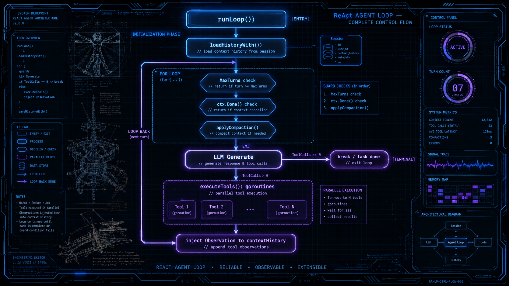
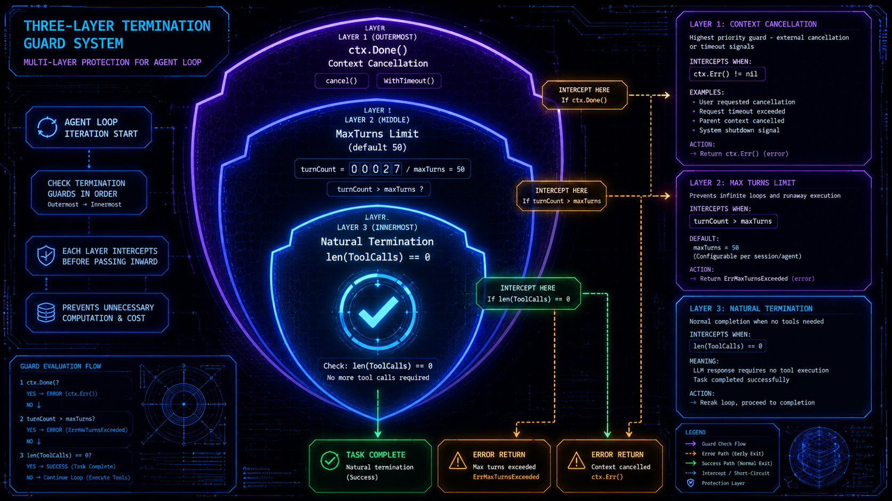
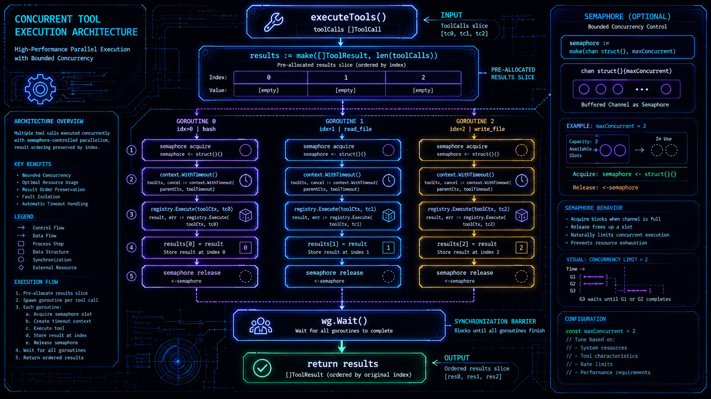
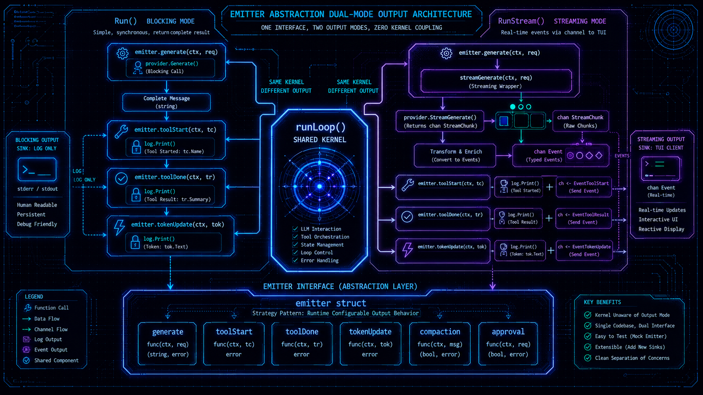
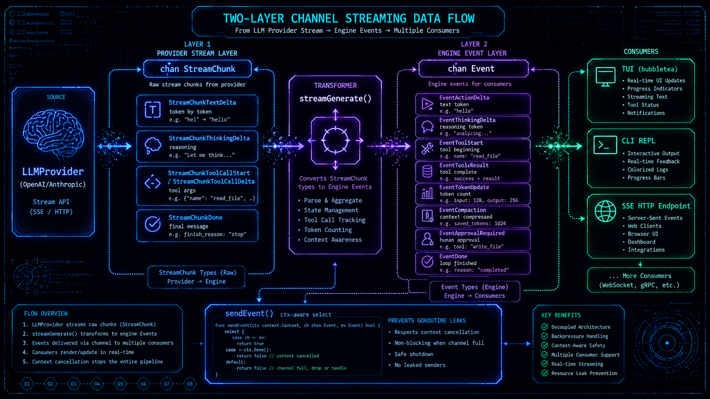

# Agent Loop — 500 行 Go 代码驱动的生产级 ReAct 主循环

## 关于 harness9

harness9 是一款轻量、完备、生产可用的 Go 语言 Agent Harness 框架。

- **官网**：[https://zhangshenao.github.io/harness9/](https://zhangshenao.github.io/harness9/)
- **GitHub**：[https://github.com/ZhangShenao/harness9](https://github.com/ZhangShenao/harness9)

⭐ Star 是对开源工作最直接的支持，欢迎提 Issue 和 PR。

---

## TL;DR

harness9 的 AgentLoop 核心在 `internal/engine/` 目录下，不到 500 行 Go 代码。它用一个显式 `for` 循环实现标准推理行动循环（ReAct Loop），用 goroutine 并发执行工具，用 `emitter` 抽象解耦阻塞模式和流式模式，用三重条件保障循环终止。没有图引擎，没有第三方 Loop 框架，循环控制权完全在框架手里。

---

## 为什么不是图引擎

在动手讲实现之前，先回答一个更基本的问题：为什么 harness9 选择显式循环，而不是更"现代"的图编排？

对比调研的七个框架，选择可以分成三类：

- **委托型**：OpenCode 和 OpenClaw 把循环控制权交给 Vercel AI SDK 的 `streamText`，通过 `maxSteps` 参数限制轮次。好处是代码少，代价是循环逻辑变成黑盒，无法在每轮之间插入自定义逻辑。
- **图编排型**：DeepAgents 委托 LangGraph 的 `StateGraph`，通过 `recursion_limit: 9999` 控制深度。图模型带来强大的分支和并发能力，但也引入了图引擎依赖和陡峭的心智模型。
- **显式循环型**：OpenHarness、HermesAgent、OpenAI Agent SDK 都用显式 `while True` 循环，完整掌握每一次迭代的执行路径。

harness9 选择显式循环，理由非常直接：**Agent Loop 本质上是一个带状态的迭代过程，用循环表达它比用图更自然**。每一轮的逻辑是线性的——调用 LLM、检查终止、执行工具、注入观察结果——这不是一个需要图来建模的问题。引入图引擎只会把 200 行清晰的代码变成另一个需要理解的框架。

Go 的 `for` 循环加上 `goroutine`，已经足够。

---

## ReAct 主循环的结构




`runLoop` 是 `Run` 和 `RunStream` 共享的主循环内核，位于 `internal/engine/agent_loop.go`。整体结构：

```go
func (e *AgentEngine) runLoop(ctx context.Context, userPrompt string, logPrefix string, em emitter) error {
    // 1. 快照配置（避免与 TUI goroutine 的数据竞争）
    e.mu.RLock()
    sess, comp, planMode, todoStore := e.session, e.compactor, e.planMode, e.todoStore
    e.mu.RUnlock()

    contextHistory, startLen := e.loadHistoryWith(ctx, userPrompt, sess)
    defer func() { /* 保存 TodoStore */ }()

    turnCount := 0
    for {
        turnCount++

        // 三重终止保障
        if e.maxTurns > 0 && turnCount > e.maxTurns { return ... }
        select { case <-ctx.Done(): return ...; default: }

        // 压缩 + token 估算 + LLM 调用
        compactedHistory := e.applyCompactionWith(comp, contextHistory)
        responseMsg, usage, err := em.generate(ctx, turnCount, compactedHistory, availableTools)
        contextHistory = append(contextHistory, *responseMsg)

        // 自然终止
        if len(responseMsg.ToolCalls) == 0 { break }

        // 并发工具执行
        results := e.executeTools(ctx, turnCount, responseMsg.ToolCalls, logPrefix, em)

        // 注入 Observation
        for i, toolCall := range responseMsg.ToolCalls {
            contextHistory = append(contextHistory, schema.Message{
                Role: schema.RoleUser, Content: results[i].Output, ToolCallID: toolCall.ID,
            })
        }
    }

    e.saveHistoryWith(ctx, sess, contextHistory, startLen)
    return nil
}
```

循环体的结构就是 ReAct 的语义：推理（Think）由 LLM 完成，行动（Act）由工具执行，观察（Observe）通过 Observation 注入上下文，然后进入下一轮推理。

---

## 上下文初始化：system prompt 不持久化

进入循环之前，`loadHistoryWith` 完成两件事：从 `Session` 恢复历史，注入 system prompt。

```go
func (e *AgentEngine) loadHistoryWith(ctx context.Context, userPrompt string, sess memory.Session) ([]schema.Message, int) {
    var history []schema.Message
    if sess != nil {
        msgs, _ := sess.GetMessages(ctx, 0)
        history = msgs
    }
    // system prompt 不持久化到 DB，每次调用时重新注入
    if len(history) == 0 || history[0].Role != schema.RoleSystem {
        history = append([]schema.Message{{Role: schema.RoleSystem, Content: e.buildSystemPrompt()}}, history...)
    }
    startLen := len(history)
    history = append(history, schema.Message{Role: schema.RoleUser, Content: userPrompt})
    return history, startLen
}
```

`startLen` 标记了"本次 Run 新增消息的起始位置"。`saveHistoryWith` 调用时只持久化 `msgs[startLen:]`，system prompt 不写库。这个决策避免了重复持久化 system prompt 的问题——跨会话 system prompt 可能会变（比如工作目录变更、Skills 更新），每次从头重建才能保证正确性。

---

## 三重终止保障

无限循环是 Agent 系统最常见的故障模式。harness9 用三层机制防止它：




**第一层：自然终止。** 模型不再发起工具调用时，任务完成，主动 `break`：

```go
if len(responseMsg.ToolCalls) == 0 {
    break
}
```

**第二层：MaxTurns 安全阀。** 默认 50 轮，防止模型陷入工具调用死循环：

```go
if e.maxTurns > 0 && turnCount > e.maxTurns {
    return fmt.Errorf("已达最大 Turn 数 (%d)，循环终止", e.maxTurns)
}
```

**第三层：Context 取消。** 每轮循环开始时检测外部取消信号，支持超时控制和手动中断：

```go
select {
case <-ctx.Done():
    return fmt.Errorf("context 已取消: %w", ctx.Err())
default:
}
```

注意检查顺序：Context 取消在 MaxTurns 检查之后。当 `turnCount` 超限时直接返回错误，不再消耗 `ctx.Done()` 的检查开销。这是一个微小但有意识的排列——通常 MaxTurns 触发比外部取消更常见。

测试用例 `TestMaxTurnsLimit` 和 `TestContextCancellation` 直接验证这两种路径：

```go
// MaxTurns 安全阀：LLM 持续发起工具调用时，达到上限后强制退出
eng := NewAgentEngine(p, r, "/test", WithMaxTurns(2))
err := eng.Run(context.Background(), "loop forever")
// err 包含 "最大 Turn 数"

// Context 取消：立即 cancel 后调用
ctx, cancel := context.WithCancel(context.Background())
cancel()
err = eng.Run(ctx, "cancelled task")
// err 包含 "context 已取消"
```

---

## 并发工具执行：goroutine + 预分配切片

当模型在一轮内发起多个工具调用时，串行执行是一种性能浪费。harness9 用 goroutine 并发执行所有工具。




`executeTools` 的实现紧凑且无数据竞争：

```go
func (e *AgentEngine) executeTools(ctx context.Context, turn int, toolCalls []schema.ToolCall, logPrefix string, em emitter) []schema.ToolResult {
    results := make([]schema.ToolResult, len(toolCalls)) // 预分配，按索引写入
    var wg sync.WaitGroup

    var sem chan struct{}
    if e.maxConcurrentTools > 0 {
        sem = make(chan struct{}, e.maxConcurrentTools) // 信号量限制并发度
    }

    for i, toolCall := range toolCalls {
        wg.Add(1)
        go func(idx int, tc schema.ToolCall) {
            defer wg.Done()

            if sem != nil {
                sem <- struct{}{}
                defer func() { <-sem }()
            }

            toolCtx := ctx
            var cancel context.CancelFunc
            if e.toolTimeout > 0 {
                toolCtx, cancel = context.WithTimeout(ctx, e.toolTimeout)
                defer cancel()
            }

            em.toolStart(turn, tc)
            start := time.Now()
            results[idx] = e.registry.Execute(toolCtx, tc) // 写入独立索引位置
            em.toolDone(turn, tc, results[idx], time.Since(start))
        }(i, toolCall)
    }

    wg.Wait()
    return results
}
```

几个关键设计决策：

**预分配切片 + 索引写入，而不是 channel 收集。** 结果集大小在循环开始前已知（`len(toolCalls)`），不需要动态扩容。每个 goroutine 写入独立的 `results[idx]`，天然无锁——不同索引之间没有内存共享冲突。这比用 `channel` 收集结果再排序更简单，也避免了排序开销。

**`idx` 和 `tc` 显式传参，不用闭包捕获。** Go 的 range 变量在循环迭代中被复用，如果用闭包直接捕获 `i` 和 `toolCall`，所有 goroutine 可能读到相同的最终值。`go func(idx int, tc schema.ToolCall)` 的传参方式在编译期就确定了每个 goroutine 的独立副本。

**信号量用有缓冲 channel。** `make(chan struct{}, maxConcurrentTools)` 是 Go 中信号量的惯用实现。0 表示不限制并发（`sem` 为 nil），直接跳过 acquire/release 逻辑，没有任何额外开销。

**每个工具独立 `context.WithTimeout`。** `toolCtx` 从父 `ctx` 派生，单个工具超时不影响同 Turn 内其他工具的执行。超时的工具返回 `IsError: true` 的结果，LLM 收到 Observation 后可以重试。

---

## 自愈能力：错误是 Observation，不是异常

传统的错误处理哲学是：工具失败 = 中断执行，向上抛错。harness9 采用完全不同的处理方式：**工具执行失败的结果原样回传给 LLM 作为 Observation**。

`ToolResult.IsError` 是这个机制的关键字段：

```go
type ToolResult struct {
    ToolCallID string `json:"tool_call_id"`
    Output     string `json:"output"`   // 失败时是错误信息
    IsError    bool   `json:"is_error"` // 标记执行失败
}
```

当 `Registry.Execute` 返回 `IsError: true` 的结果时，`runLoop` 不返回错误，而是把这个结果当作普通 Observation 注入上下文：

```go
for i, toolCall := range responseMsg.ToolCalls {
    contextHistory = append(contextHistory, schema.Message{
        Role:       schema.RoleUser,
        Content:    results[i].Output, // "command not found" 或其他错误信息
        ToolCallID: toolCall.ID,
    })
}
```

LLM 在下一轮收到包含错误信息的上下文，可以诊断原因并修正参数重试。测试 `TestToolErrorResult` 验证了这一链路：

```go
// errorRegistry 对任何工具调用都返回 IsError: true 的结果
r := &errorRegistry{} // output: "command not found", IsError: true
eng := NewAgentEngine(p, r, "/test")
err := eng.Run(context.Background(), "test error")
// 不返回 error，错误作为 Observation 传给下一轮 LLM

// 验证：第二轮 LLM 收到的最后一条消息包含错误输出
lastMsg := p.calls[1].messages[len(p.calls[1].messages)-1]
// lastMsg.Content 包含 "command not found"
```

这个设计的代价是：如果 LLM 不能修复问题，循环会持续直到 MaxTurns 触发。收益是：很多工具调用失败可以自动恢复，不需要人工干预。

---

## emitter 抽象：一个循环，两种输出

harness9 的一个核心设计决策是：**阻塞模式（`Run`）和流式模式（`RunStream`）共享同一个 `runLoop` 实现**。两者的区别完全封装在 `emitter` 结构体中。




`emitter` 的定义清楚地揭示了两种模式的差异点：

```go
type emitter struct {
    generate    func(ctx context.Context, turn int, history []schema.Message, tools []schema.ToolDefinition) (*schema.Message, *schema.Usage, error)
    toolStart   func(turn int, tc schema.ToolCall)
    toolDone    func(turn int, tc schema.ToolCall, result schema.ToolResult, d time.Duration)
    tokenUpdate func(tokens, window int)
    compaction  func(data CompactionData)
    approval    hooks.ApprovalFunc // Human-in-the-Loop 审批回调
}
```

`Run` 构造的 `emitter`，`generate` 调用阻塞式 `provider.Generate`，文本打印到 stdout：

```go
em := emitter{
    generate: func(ctx context.Context, _ int, history []schema.Message, tools []schema.ToolDefinition) (*schema.Message, *schema.Usage, error) {
        msg, usage, err := e.provider.Generate(ctx, history, tools)
        if msg.Content != "" {
            fmt.Printf("[assistant] %s\n", msg.Content)
        }
        return msg, usage, nil
    },
    toolStart: func(turn int, tc schema.ToolCall) {
        log.Print(logfmt.FormatToolStart("engine", turn, tc))
    },
    // ...
}
```

`RunStream` 构造的 `emitter`，`generate` 调用 `streamGenerate`，将文本增量转发为 `EventActionDelta` 发送到 channel：

```go
em := emitter{
    generate: func(ctx context.Context, turn int, history []schema.Message, tools []schema.ToolDefinition) (*schema.Message, *schema.Usage, error) {
        return e.streamGenerate(ctx, ch, turn, history, tools)
    },
    toolStart: func(turn int, tc schema.ToolCall) {
        log.Print(logfmt.FormatToolStart("engine-stream", turn, tc))
        sendEvent(ctx, ch, Event{Type: EventToolStart, Turn: turn, Data: tc})
    },
    // ...
}
```

`runLoop` 本身对输出方式一无所知，它只调用 `em.generate`、`em.toolStart`、`em.toolDone`。这是策略模式（Strategy Pattern）的直接应用，但比定义接口更轻量——用函数字段而不是接口，省去了类型断言和方法集的心智负担。

---

## 流式架构：两层 channel

`RunStream` 的数据流经过两层 channel 转换：




**第一层**：`provider.GenerateStream` 返回 `<-chan StreamChunk`，这是 Provider 层的增量协议，携带 token 级别的文本增量和工具调用参数增量。

**第二层**：`streamGenerate` 消费 `StreamChunk` channel，将其转换为面向客户端的语义化 `Event`，发送到 `chan Event`：

```go
func (e *AgentEngine) streamGenerate(ctx context.Context, ch chan<- Event, turn int,
    history []schema.Message, tools []schema.ToolDefinition) (*schema.Message, *schema.Usage, error) {

    stream, err := e.provider.GenerateStream(ctx, history, tools)
    // ...
    for chunk := range stream {
        switch chunk.Type {
        case schema.StreamChunkTextDelta:
            if !sendEvent(ctx, ch, Event{Type: EventActionDelta, Turn: turn, Data: chunk.Delta}) {
                return nil, nil, ctx.Err()
            }
        case schema.StreamChunkThinkingDelta:
            if !sendEvent(ctx, ch, Event{Type: EventThinkingDelta, Turn: turn, Data: chunk.Delta}) {
                return nil, nil, ctx.Err()
            }
        case schema.StreamChunkDone:
            msg = chunk.Message
            usage = chunk.Usage
        }
    }
    return msg, usage, nil
}
```

`sendEvent` 是一个关键的辅助函数，它用 `select` 同时监听 channel 发送和 `ctx.Done()`：

```go
func sendEvent(ctx context.Context, ch chan<- Event, evt Event) bool {
    select {
    case <-ctx.Done():
        return false
    case ch <- evt:
        return true
    }
}
```

没有这个 `select`，当消费者（TUI）停止读取 channel 时，生产者 goroutine 会永久阻塞，造成 goroutine 泄漏。

`RunStream` 本身在一个独立 goroutine 中运行 `runLoop`，channel 在 goroutine 退出时自动关闭：

```go
func (e *AgentEngine) RunStream(ctx context.Context, userPrompt string) (<-chan Event, error) {
    ch := make(chan Event)
    go func() {
        defer close(ch)
        // ...
        if err := e.runLoop(ctx, userPrompt, "engine-stream", em); err != nil {
            ch <- Event{Type: EventError, Data: err.Error()}
            return
        }
        ch <- Event{Type: EventDone}
    }()
    return ch, nil
}
```

注意终止事件（`EventDone` / `EventError`）使用直接 `ch <-` 而不是 `sendEvent`。这是故意的——终止事件必须到达消费者，不能因为 context 取消而丢失。

---

## 引擎的状态管理：RWMutex 快照

`AgentEngine` 是有状态的——它持有 `Session`、`Compactor`、`PlanMode` 等可在运行时更新的字段。TUI 中用户可以通过 `/new`、`/resume` 命令切换会话，通过 `Shift+Tab` 切换 Plan Mode。

这带来了并发问题：`SetSession` 和 `SetPlanMode` 可能在 `runLoop` 执行过程中被 TUI goroutine 调用。

解决方案是在 `runLoop` 入口做一次**快照**：

```go
e.mu.RLock()
sess := e.session
comp := e.compactor
planMode := e.planMode
todoStore := e.todoStore
e.mu.RUnlock()
```

之后整个循环使用局部变量 `sess`、`comp`、`planMode`，不再访问 `e` 的字段。`SetSession` 的修改对当前正在运行的 `runLoop` 无影响，只在下一次调用时生效。

这个设计的清晰之处：**锁的持有时间极短**（只有读取字段的几微秒），不会与循环内的 LLM 调用（可能几秒甚至几十秒）产生锁竞争。

---

## Plan Mode：工具层硬约束

harness9 的规划模式（Plan Mode）在工具层面实现了只读约束，而不是在 prompt 层面软约束。

```go
var planModeWhitelist = map[string]bool{
    "read_file":  true,
    "bash":       true,
    "use_skill":  true,
    "todo_write": true,
}

func filterReadOnlyTools(tools []schema.ToolDefinition) []schema.ToolDefinition {
    var result []schema.ToolDefinition
    for _, t := range tools {
        if planModeWhitelist[t.Name] {
            result = append(result, t)
        }
    }
    return result
}
```

Plan Mode 下，`write_file` 和 `edit_file` 从传给 LLM 的工具列表中被移除。LLM 在任何情况下都无法调用这两个工具——不是因为 prompt 告诉它不要用，而是因为它根本看不到这两个工具的定义。

这个区别很重要。Prompt 层软约束依赖模型遵守指令，在对话轮次增加、上下文复杂时可靠性下降。工具层硬约束是结构性的，与模型行为无关。

测试 `TestRunLoop_PlanMode_FiltersWriteTools` 验证了这一约束：`write_file` 和 `edit_file` 从 LLM 收到的工具列表中消失，`read_file`、`bash`、`todo_write` 保留。

---


## 数据模型：延迟解析的 `RawMessage`

`schema` 包定义了 harness9 的消息契约。其中一个值得关注的设计：`ToolCall.Arguments` 使用 `json.RawMessage`：

```go
type ToolCall struct {
    ID        string          `json:"id"`
    Name      string          `json:"name"`
    Arguments json.RawMessage `json:"arguments"` // 延迟反序列化
}
```

LLM 返回的工具调用参数是 JSON，但每个工具的参数结构不同。用 `json.RawMessage` 延迟反序列化，引擎层不需要知道每个工具的参数结构——这是具体工具实现的责任。引擎只负责传递，工具自己解析。

`ToolDefinition.InputSchema` 同样使用 `any` 类型：

```go
type ToolDefinition struct {
    Name        string `json:"name"`
    Description string `json:"description"`
    InputSchema any    `json:"input_schema"` // 兼容不同 SDK 的参数格式
}
```

OpenAI SDK 需要 `shared.FunctionParameters`，Anthropic SDK 需要 `map[string]any`。用 `any` 让 Provider 在自己的适配层做类型转换，引擎层对此无感知。

这两个设计的共同原则：**把解析责任推到最靠近使用者的层次**。

---

## 可观测性：结构化日志与 token 感知

每轮循环执行前，引擎估算当前上下文的 token 用量，在 LLM 调用后用实际值更新：

```go
// 估算值（调用前）
msgTokensAfter := memory.EstimateTokens(compactedHistory)
toolTokens := memory.EstimateToolTokens(availableTools)
em.tokenUpdate(msgTokensAfter + toolTokens, e.contextWindow)

// 实际值（调用后，从 API response usage 字段提取）
if usage != nil && usage.InputTokens > 0 {
    em.tokenUpdate(usage.InputTokens, e.contextWindow)
}
```

TUI 状态栏根据 `contextWindow` 计算使用率，在接近限制时变色告警。这个双步更新（先估算、后修正）保证了 TUI 在 LLM 调用期间就能显示进度，而不是等调用完成后才更新。

阻塞模式和流式模式使用不同的日志前缀 `[engine]` 和 `[engine-stream]`，便于在混合使用时区分日志来源。

---

## 设计取舍总结

harness9 的 Agent Loop 设计明确放弃了几件事：

**放弃图编排，保留清晰性。** LangGraph 提供了强大的图编排能力，但 Agent 的单线程推理路径用 `for` 循环表达更直观。图模型的优势在多 Agent 编排，单 Agent 场景里它带来的是复杂度而非能力。

**放弃外部 Loop 框架，保留控制权。** 把 `maxSteps` 传给 Vercel AI SDK 可以少写几十行代码，但失去了在每轮之间插入自定义逻辑（压缩检查、Plan Mode 过滤、token 统计）的能力。

**放弃路径冲突检测，选择无条件并发。** HermesAgent 在工具并发执行前做路径冲突检测（同一文件的读写不能并行）。harness9 不做这个检测，所有工具无条件并发。原因是 harness9 在 `tools/path_locker.go` 中实现了路径级读写锁，并发冲突在执行层面解决，而不是在调度层面提前检测。

这些取舍背后的共同逻辑是：**用更少的代码，在正确的层次解决问题**。

---

## 结语

harness9 的 Agent Loop 没有技巧，只有清晰的职责划分：`emitter` 封装输出差异，`executeTools` 封装并发执行，`loadHistoryWith` 封装上下文恢复，`runLoop` 只做调度。

一个思考留给读者：当 LLM 在一轮内同时调用 `write_file` 写入文件 A 和 `read_file` 读取同一文件 A 时，并发执行是否可能产生竞态？harness9 的 `path_locker.go` 是怎么处理这个问题的？

答案在 `internal/tools/path_locker.go`。
