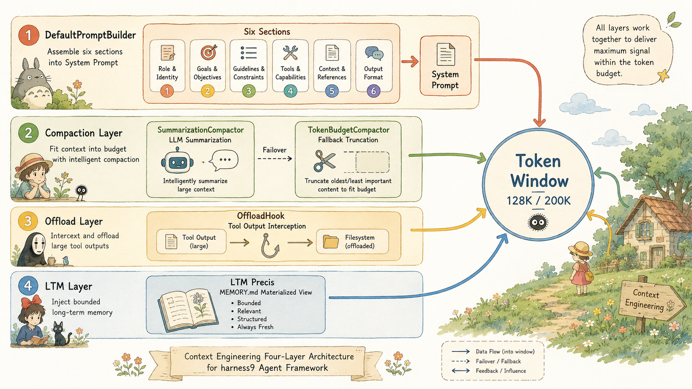
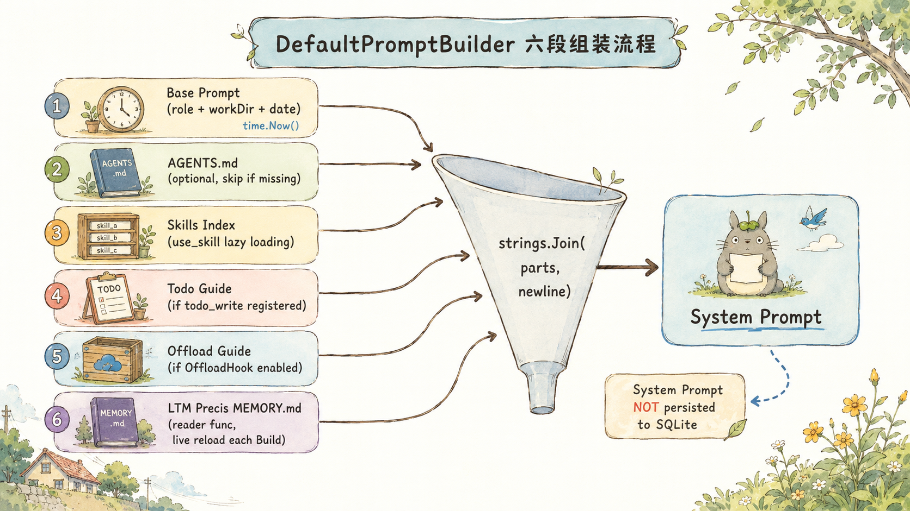
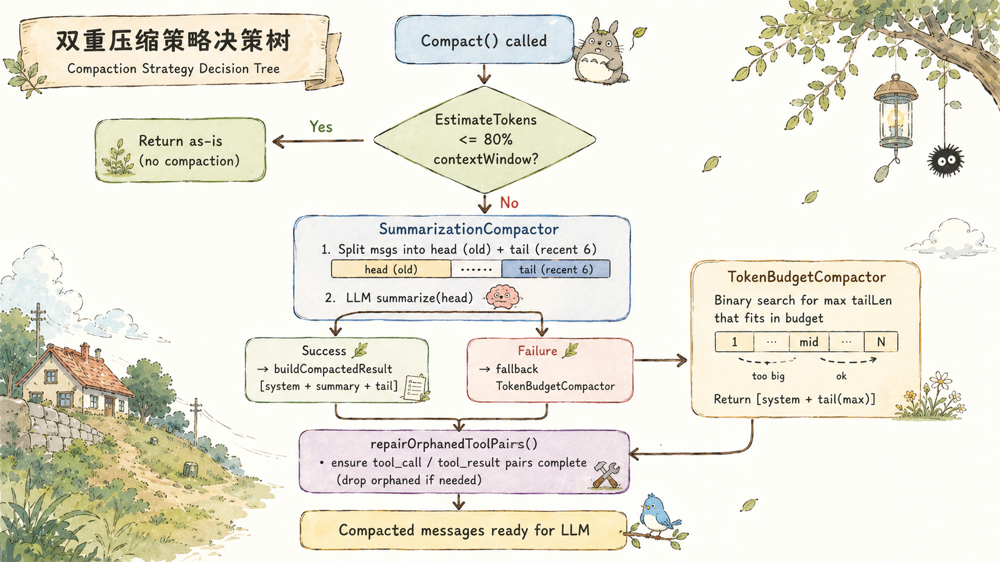
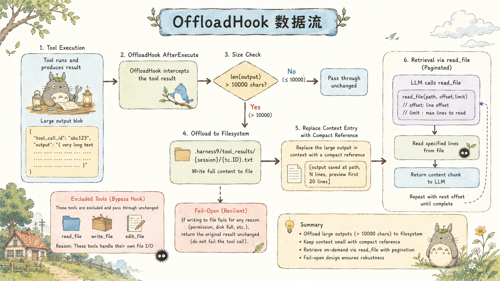
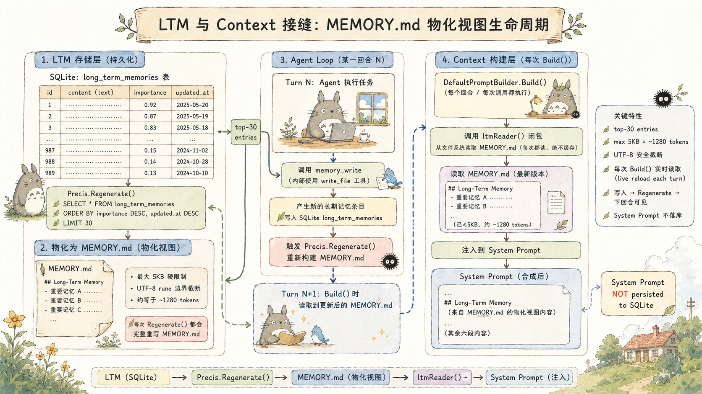
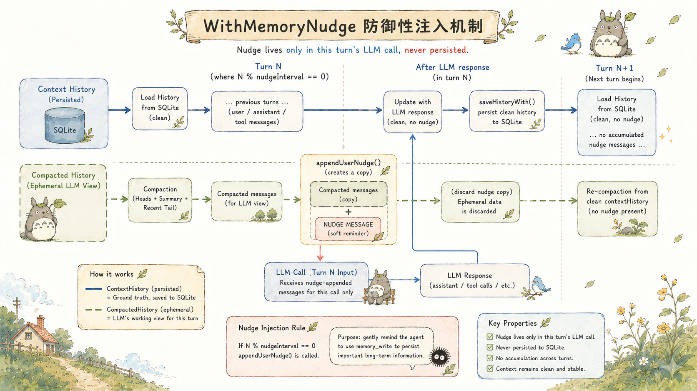
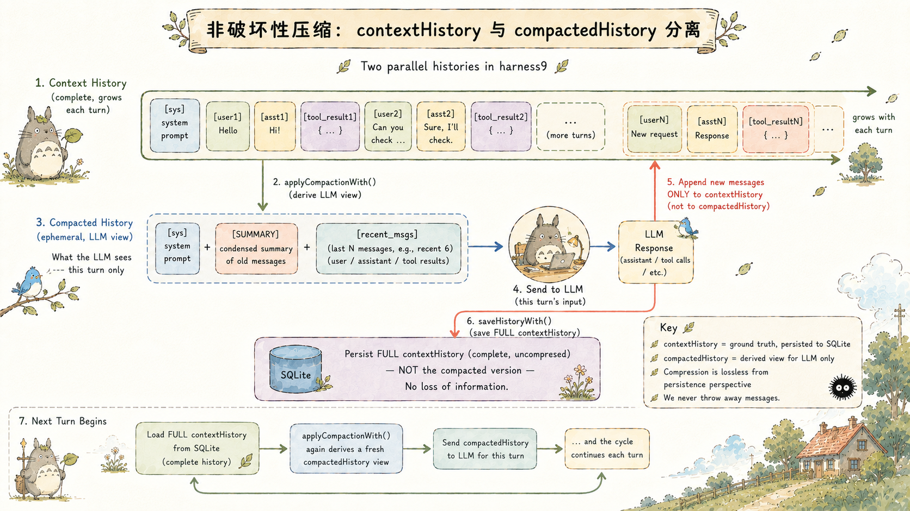

# Context Engineering — 一个 Agent 如何在有限的 Token 窗口里保持清醒

## 关于 harness9

harness9 是一款 Local-First、轻量级、功能完备、生产可用的通用 Go Agent 框架。

- **官网**：[https://zhangshenao.github.io/harness9/](https://zhangshenao.github.io/harness9/)
- **GitHub**：[https://github.com/ZhangShenao/harness9](https://github.com/ZhangShenao/harness9)

⭐ Star 是对开源工作最直接的支持，欢迎提 Issue 和 PR。

---


## TL;DR

- **Context Engineering = 四层管道**：System Prompt 组装 → 上下文压缩 → 大输出外置 → 长期记忆有界注入，每层独立可拆卸
- **DefaultPromptBuilder** 每次 `Build()` 重新调用 `time.Now()` 注入当前日期，防止 `web_search` 生成陈旧查询词；System Prompt 不持久化到 SQLite，prompt 版本可自由演进
- **双重压缩**：SummarizationCompactor（默认，LLM 摘要 + 增量合并）在 80% 阈值触发；TokenBudgetCompactor（兜底，字符截断）在 LLM 不可用时接管；两者都调用 `repairOrphanedToolPairs` 修复 Anthropic API 的孤立工具对
- **OffloadHook** 拦截超过 10000 字符的工具输出，写入 `.harness9/tool_results/`，context 保留分页引用；fail-open，写入失败不中断 agent loop
- **MEMORY.md 物化视图**：top-30 条目 + 5KB 硬上限 + UTF-8 rune 边界截断，三重防御 token bomb；ltmReader 闭包保证"写入即下一轮可见"
- **`contextHistory`（完整，持久化）vs `compactedHistory`（临时，LLM 视图）分离**：压缩对持久化层无损，每轮都从完整历史派生压缩视图，不叠加信息损失

---

## 本文你将学到

- 你将看清 DefaultPromptBuilder 如何把六段异构信息组装成一个结构化 System Prompt，以及为什么每次 Build() 都重新调用 `time.Now()`
- 你将理解 SummarizationCompactor 的增量更新机制——为什么它不是每次全量重摘，而是把上次摘要传给 LLM 做合并
- 你将看到 TokenBudgetCompactor 的 `repairOrphanedToolPairs` 双向修复如何避免 Anthropic API 的 400 错误
- 你将弄清 OffloadHook 的 fail-open 设计哲学：文件写入失败不中断 agent loop
- 你将理解 MEMORY.md 物化视图的有界注入——top-30 条目、5KB 硬上限、UTF-8 rune 边界截断，三重防御 token bomb

---

## Token 窗口是 Agent 的工作记忆

一个 Agent 在长任务中面临的核心矛盾：LLM 靠完整的对话历史做推理，但 token 窗口是有限的。历史越长，推理越准确；历史越长，越快触顶。

这不是单纯的工程问题，而是信息论层面的约束。token 窗口里放什么、怎么放、放多少，决定了 Agent 在第 50 轮时还能不能记得第 3 轮写了哪个文件。

harness9 把这个问题拆成四层来解决：

1. **System Prompt 组装**：每轮开始前，把最重要的结构化信息放在窗口最前面
2. **上下文压缩**：历史消息超出预算时，用 LLM 摘要替代原始对话
3. **大输出外置**：单次工具输出超过阈值，写到文件系统，context 里只保留引用，让 Agent 自主决策何时 reload 回 context
4. **长期记忆注入**：跨会话的持久知识，有界注入进当前窗口

每一层都是独立的，可以单独关掉，也可以叠加。




---

## DefaultPromptBuilder：六段拼装的 System Prompt

多数框架的 System Prompt 是一段硬编码字符串，改动一个字要重新部署。harness9 的 `DefaultPromptBuilder` 把它设计成动态组装——六个独立段落，每次 `Build()` 时按需拼接。

```go
func (b *DefaultPromptBuilder) Build() string {
    var parts []string

    // 1. 基础 prompt：角色定义 + 工作目录 + 当前日期 + 工作准则
    parts = append(parts, fmt.Sprintf("...\n工作目录：%s\n当前日期：%s\n...",
        b.workDir, time.Now().Format("2006-01-02")))

    // 2. AGENTS.md：用户项目规范，不存在时静默跳过
    if data, err := os.ReadFile(agentsPath); err == nil && len(data) > 0 {
        parts = append(parts, "## 项目规范（AGENTS.md）\n\n"+string(data))
    }

    // 3. Skills 索引：LLM 按需 use_skill 加载全文
    if b.skillsIndex != nil && !b.skillsIndex.IsEmpty() {
        parts = append(parts, "## 可用 Skills\n\n"+b.skillsIndex.Summary())
    }

    // 4-6. todo 指引 / offload 检索 / 长期记忆（按配置注入）
    // ...
    return strings.Join(parts, "\n\n")
}
```

几个值得注意的设计决策：

**`time.Now()` 在每次 `Build()` 时调用**，而不是在构造函数里缓存。原因是 `runLoop` 每轮循环都会重新构建 System Prompt，如果 Agent 跑了两个小时，第 200 轮的 System Prompt 里应该是当前日期，而不是启动时的日期。这直接影响 `web_search` 工具的查询质量——LLM 用错误的日期生成搜索词，结果会是陈旧的。

**AGENTS.md 不存在时静默跳过**。这是 fail-open 哲学的体现：工具运行在用户任意目录，不能假设 AGENTS.md 一定存在。

**System Prompt 不持久化到 SQLite**。`loadHistoryWith` 在加载历史时重新注入 system 消息，`saveHistoryWith` 保存的是 `msgs[startLen:]`，system 消息被跳过。这样 prompt 可以随配置更新而变化，历史数据不会锁定 prompt 版本。




---

## 双重压缩策略：摘要为主，截断兜底

harness9 的压缩层有两个实现，对应两种不同的工程取舍。

### SummarizationCompactor：LLM 摘要，保留语义

`SummarizationCompactor` 是默认策略。当 token 估算值超过 contextWindow × 80% 时触发，把旧消息送给 LLM 压缩成结构化摘要：

```go
func (c *SummarizationCompactor) Compact(msgs []schema.Message) []schema.Message {
    if EstimateTokens(msgs) <= c.maxTokens() {
        return msgs  // 未超阈值，直接返回
    }
    // 分割：head（旧消息）| tail（最近 6 条，强制保留）
    headEnd := len(rest) - minTail
    head, tail := rest[:headEnd], rest[headEnd:]

    // 压缩前先提取长期记忆（fail-open，失败不影响压缩）
    if c.extractor != nil {
        c.extractor.Extract(head)
    }

    summary, err := c.summarize(head)
    if err != nil {
        return c.fallback().Compact(msgs)  // LLM 失败，回退截断
    }
    return c.buildCompactedResult(msgs[0], summary, tail)
}
```

**增量更新机制**是这里最有价值的设计。如果 head 里已经有上次的摘要消息（以 `[Conversation Summary]` 开头），`summarize` 不会全量重摘，而是把旧摘要和新对话一起传给 LLM，请求合并更新：

```go
if prevSummary != "" {
    userContent = fmt.Sprintf(incrementalTemplate, prevSummary, conversationText)
} else {
    userContent = fmt.Sprintf(summaryTemplate, conversationText)
}
```

`incrementalTemplate` 的结构是：

```
Update the existing summary by merging in new conversation content.
<previous-summary>
{上次摘要}
</previous-summary>

New conversation to merge:
{新对话文本}
```

为什么不每次全量重摘？因为全量重摘在多次压缩后会产生信息叠加丢失——第二次摘要是对第一次摘要的摘要，关键细节在每一层都在衰减。增量合并让 LLM 在有完整上次摘要的前提下做更新，信息损失更小。

摘要的输出格式固定为五个维度：Goal、Progress、Key Decisions、Next Steps、Critical Context。这不是随意的——Critical Context 段专门保存文件路径、变量名、约束条件这些 LLM 在后续轮次里需要精确引用的信息。

### TokenBudgetCompactor：字符截断，永远可用

`TokenBudgetCompactor` 是回退策略。它不调用 LLM，纯粹靠字符计数做截断。好处是不依赖 Provider 可用性，坏处是旧消息直接丢弃，没有语义保留。

```go
func NewTokenBudgetCompactor(contextWindow int) *TokenBudgetCompactor {
    return &TokenBudgetCompactor{
        MaxTokens:       contextWindow * 80 / 100,
        MinTailMessages: 6,
    }
}
```

80% 阈值不是拍脑袋的数字。剩余 20% 要给工具定义（bash/read_file 等工具的 JSON Schema 描述可以消耗 10-30K tokens），以及 char÷4 估算本身的误差缓冲，以及 LLM 生成输出的空间。

### 孤立工具对修复：Anthropic API 的硬性要求

截断之后有一个必须处理的问题：Anthropic Messages API 要求 `tool_call` 和 `tool_result` 必须成对出现。截断可能产生两类孤立消息：

- **类型 A**：有 `tool_result` 但对应的 `tool_call` 被截掉了
- **类型 B**：有 `tool_call` 但对应的 `tool_result` 被截掉了

`repairOrphanedToolPairs` 用两次扫描解决这个问题：

```go
func repairOrphanedToolPairs(msgs []schema.Message) []schema.Message {
    // Pass 1：收集所有 assistant 发出的 tool_call ID
    calledIDs := make(map[string]bool)
    resultIDs := make(map[string]bool)
    // ...

    for _, m := range msgs {
        // 删除孤立的 tool_result
        if m.ToolCallID != "" && !calledIDs[m.ToolCallID] {
            continue
        }
        result = append(result, m)
        // 为孤立的 tool_call 插入占位 tool_result
        if m.Role == schema.RoleAssistant && len(m.ToolCalls) > 0 {
            for _, tc := range m.ToolCalls {
                if !resultIDs[tc.ID] {
                    result = append(result, schema.Message{
                        Role:       schema.RoleUser,
                        Content:    "[工具结果不可用：上下文已被压缩]",
                        ToolCallID: tc.ID,
                    })
                }
            }
        }
    }
    return result
}
```

`SummarizationCompactor`、`TokenBudgetCompactor`、`SlidingWindowCompactor` 三者都在压缩后调用这个修复函数。占位消息的内容是 `[工具结果不可用：上下文已被压缩]`，LLM 看到这条信息会知道历史被压缩过，而不是工具执行失败。




---

## OffloadHook：防止 Context 被单次输出撑爆

仅有 Context Compation 机制，还无法保证绝对安全。试想下面的场景：
一个 `bash("cat large_file.log")` 可以输出几十万字节。如果这个输出直接进 contextHistory，不仅吃掉大量 token 预算，还会立即触发压缩，把有价值的历史对话挤掉。

为了解决这个问题，我们引入了 Hook 机制：
`OffloadHook` 在工具执行完成后拦截输出，超过 10000 字符时写入文件系统，把 context 里的内容替换为引用：

```go
func (h *OffloadHook) AfterExecute(_ context.Context, tc schema.ToolCall, result schema.ToolResult) schema.ToolResult {
    if offloadExcluded[tc.Name] {  // read_file/write_file/edit_file 不触发 offload
        return result
    }
    if len(result.Output) <= h.threshold {
        return result
    }

    absPath := filepath.Join(h.workDir, ".harness9", "tool_results", h.sessionID, tc.ID+".txt")
    if err := os.WriteFile(absPath, []byte(originalOutput), 0600); err != nil {
        return result  // fail-open：写入失败，原样返回
    }

    result.Output = fmt.Sprintf(
        "[输出已保存至 %s，共 %d 行 / %d 字节。\n"+
        "可通过 read_file 工具配合 offset/limit 参数分页读取。\n\n"+
        "预览（前 %d 行）：\n%s\n...（已截断）]",
        relPath, totalLines, len(originalOutput), previewEnd, preview,
    )
    return result
}
```

三个细节值得关注：

**排除列表**：`read_file`、`write_file`、`edit_file` 不触发 offload。如果 `read_file` 的输出被 offload，LLM 会用 `read_file` 去读那个 offload 文件，然后那个 `read_file` 的输出又被 offload，形成无限循环。

**文件命名用 `tc.ID`**：工具调用 ID 是 LLM 生成的唯一标识符，同一个 session 内不重复。这样同一 session 内的多次大输出各自独立存储，互不覆盖。

**fail-open**：`os.WriteFile` 失败时直接 `return result`，原始输出原样返回。OffloadHook 的失败不会让 agent loop 停止，顶多是这次大输出进了 context，下一轮压缩时会处理掉。

DefaultPromptBuilder 里有专门的 offload 检索指引段落，告诉 LLM 如何用 `read_file` 配合 `offset`/`limit` 分页读取 offload 的文件。这是 LLM 和文件系统之间的协议层——LLM 知道大输出在哪里，知道怎么按需取回。




---

## LTM 与 Context 的接缝：MEMORY.md 物化视图

Long-Term Memory（长期记忆，LTM）存储在 SQLite 的 `long_term_memories` 表里，跨会话持久化。问题是：怎么把这些记忆注入当前 context 而不产生 token bomb？

直接把所有记忆条目塞进 System Prompt 是错误的——记忆越积越多，最终会把 token 窗口的相当大一部分占满。

harness9 的方案是 MEMORY.md 物化视图。`Precis` 从 Store 拉取 top-30 高价值条目（按 importance 排序），渲染成有界 Markdown 文件：

```go
const precisMaxEntries = 30

func (p *Precis) Regenerate(ctx context.Context) error {
    entries, err := p.store.List(ctx, precisMaxEntries)  // top-30
    // ...
    content := renderPrecis(entries, p.maxBytes)          // maxBytes 默认 5120
    return os.WriteFile(p.path, []byte(content), 0600)
}

func truncateUTF8(s string, maxBytes int) string {
    if len(s) <= maxBytes {
        return s
    }
    const marker = "\n…（已截断）"
    // 在 rune 边界截断，不切断多字节字符
    // ...
}
```

5KB 的上限是经过计算的：`5120 / 4 ≈ 1280 tokens`，占 128K 窗口的 1%，占 200K 窗口不到 0.7%。注入的代价可以接受，但能覆盖 30 条结构化记忆。

`DefaultPromptBuilder.Build()` 里的 LTM 注入方式是传入一个 `reader` 闭包，每次 Build 时实时调用：

```go
func (b *DefaultPromptBuilder) WithLongTermMemory(reader func() string) *DefaultPromptBuilder {
    b.ltmReader = reader
    return b
}

// Build() 内部：
if b.ltmReader != nil {
    if content := b.ltmReader(); content != "" {
        parts = append(parts, "## 长期记忆\n\n"+content)
    }
}
```

为什么是闭包而不是在构造时读取一次？因为 `memory_write` 工具在 agent 运行过程中会写入新记忆、重建 MEMORY.md，下一轮循环的 Build() 需要读到最新版本。闭包让"写入即下一轮可见"成为自然结果，不需要额外的通知机制。




---

## WithMemoryNudge：防御性注入，不持久化

在长任务中，LLM 有时会在连续几十轮工具调用后"忘记"去使用 `memory_write` 记录重要信息。`WithMemoryNudge` 是一种定期提醒机制：

```go
// 每隔 nudgeInterval 轮，向临时副本追加一行提示
if e.nudgeInterval > 0 && e.nudgeText != "" && turnCount%e.nudgeInterval == 0 {
    compactedHistory = appendUserNudge(compactedHistory, e.nudgeText)
}

func appendUserNudge(history []schema.Message, text string) []schema.Message {
    withNudge := make([]schema.Message, len(history), len(history)+1)
    copy(withNudge, history)
    return append(withNudge, schema.Message{Role: schema.RoleUser, Content: text})
}
```

`appendUserNudge` 的实现体现了一个关键约束：它操作的是 `compactedHistory`（传给 LLM 的临时视图），而不是 `contextHistory`（完整历史）。nudge 消息不会被 `saveHistoryWith` 持久化，不会在下一轮 `loadHistoryWith` 时出现，不会累积。

如果 nudge 消息进了持久化历史，几十轮之后 context 里会出现几十条内容相同的提醒，既浪费 token 又干扰 LLM 推理。"防御性副本，不持久化"是这里的工程约束，不是实现细节。

同样的模式也用在 `WithStallNudge`——停滞检测：连续多轮没有调用 `write_file`/`edit_file`（进展工具）时，注入一次提示打断空转，然后重置计数。




---

## 非破坏性压缩：两个历史，两种用途

harness9 的压缩层有一个容易忽视的设计：`contextHistory` 和 `compactedHistory` 是两个独立的变量，对应不同的生命周期和用途。

```go
// runLoop 内部：
contextHistory, startLen := e.loadHistoryWith(ctx, userPrompt, sess)

for {
    // compactedHistory：每轮派生的压缩视图，只传给 LLM
    compactedHistory := e.applyCompactionWith(comp, contextHistory)

    // LLM 看到的是 compactedHistory
    responseMsg, usage, err := e.generateWithRetry(ctx, em, turn, compactedHistory, availableTools)

    // contextHistory 持续累积完整历史（包括压缩前的所有消息）
    contextHistory = append(contextHistory, *responseMsg)
    // ...工具执行结果追加到 contextHistory...
}

// 保存完整历史，不是压缩视图
e.saveHistoryWith(ctx, sess, contextHistory, startLen)
```

`contextHistory` 是完整的对话记录，包含所有原始消息，最终持久化到 SQLite。`compactedHistory` 是每轮临时生成的、传给 LLM 的裁剪版本。

这个分离保证了一件事：压缩是无损的。下一轮压缩时，`applyCompactionWith` 拿到的是完整历史，可以重新决定保留哪些消息、摘要哪些消息，而不是对已经压缩过的结果再次压缩（那样会叠加信息损失）。代价是内存里始终持有完整历史，但对于绝大多数 Agent 任务来说，这个代价是可以接受的。




---

## Token 估算的两阶段更新

harness9 在每轮 LLM 调用前后各发一次 token 用量通知：

```go
// LLM 调用前：char÷4 估算值，用于压缩决策和初始显示
em.tokenUpdate(totalTokens, e.contextWindow)

// LLM 调用
responseMsg, usage, err := e.generateWithRetry(...)

// LLM 调用后：API 响应里的实际用量，覆盖估算值
if usage != nil && usage.InputTokens > 0 {
    em.tokenUpdate(usage.InputTokens, e.contextWindow)
}
```

`char÷4` 是业界通用的近似估算，误差通常在 ±10% 以内，不需要引入 tiktoken 等依赖。这个估算用于触发压缩决策——决策已经预留了 20% 缓冲，±10% 的误差在容忍范围内。

API 响应里的实际 InputTokens 精确得多，用于更新 TUI 状态栏的显示值。用户在 TUI 里看到的是：调用前出现估算值，调用完成后刷新为精确值。

TUI 状态栏颜色编码：`contextTokens / contextWindow` < 50% 绿色，50-80% 黄色，≥ 80% 红色。红色区域意味着下一轮很可能触发压缩。

---

## 与其他框架的对比

harness9 的 Context Engineering 和 LangChain/LangGraph 的对比有几个有意思的差异：

**无向量数据库**。LangChain 的 Memory 模块通常依赖向量嵌入做语义检索（FAISS、Chroma、Pinecone）。harness9 的 LTM 用的是 SQLite FTS5 全文检索，不需要嵌入模型，不需要额外的向量数据库进程。代价是检索质量是词法匹配而非语义匹配，但对于 Agent 的记忆检索来说，大多数查询是精确的关键词（文件路径、函数名、项目名），词法匹配已经够用。

**压缩层与存储层分离**。LangChain 的 `ConversationSummaryMemory` 把摘要和存储耦合在一起，摘要失败就意味着存储失败。harness9 的 `SummarizationCompactor` 是独立的压缩策略，存储层（SQLiteSession）始终持有完整历史，压缩只发生在"传给 LLM 的视图"层面。

**fail-open 哲学**。OffloadHook 写入失败不中断 agent loop，`saveHistoryWith` 失败只打 warning 不终止，LTM Extractor 失败也是 fail-open。harness9 的设计原则是：Context Engineering 是增强功能，不是核心依赖。LLM 的推理能力是核心，记忆和压缩是让它工作得更好的工具。

这个哲学的代价是：有时候 Agent 会因为 OffloadHook 写入失败而消耗更多 token，或者因为 LTM 写入失败而丢失记忆。但 Agent loop 不会崩溃，任务还是会继续推进。

---

## 结语

harness9 的 Context Engineering 本质上是在回答一个问题：如何让一个有限的 token 窗口承载尽可能多的有效信息？

六段 System Prompt 组装、双重压缩策略、OffloadHook 外置、MEMORY.md 有界注入、nudge 防御性注入——每一层都是这个问题的一个局部答案，组合起来形成一个完整的信息密度管理体系。

值得思考的问题是：随着 LLM context window 越来越大（Gemini 已经到了 1M tokens），这些精心设计的压缩策略是否最终会变得不必要？还是说 Agent 的任务复杂度会跟着扩展，信息密度的问题永远不会消失？

---


